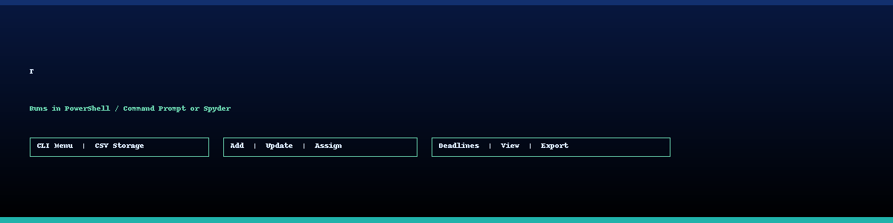
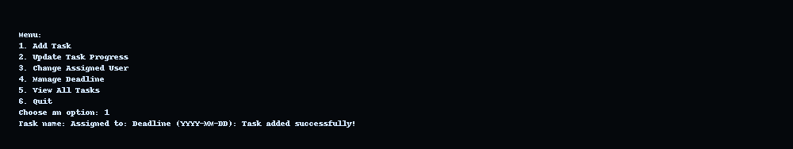
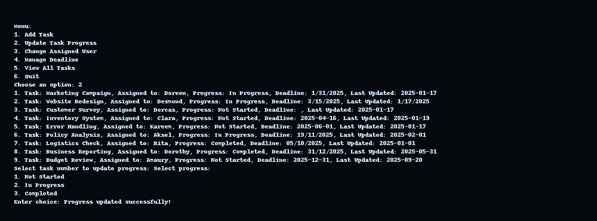
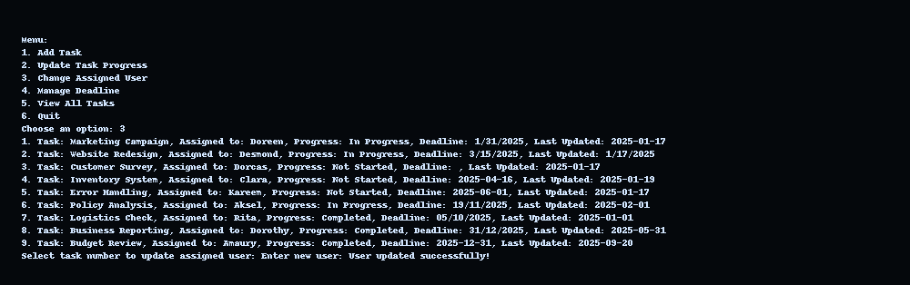
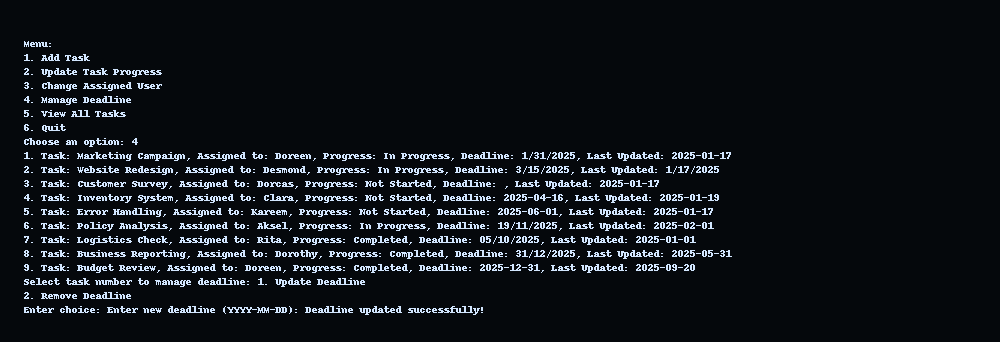
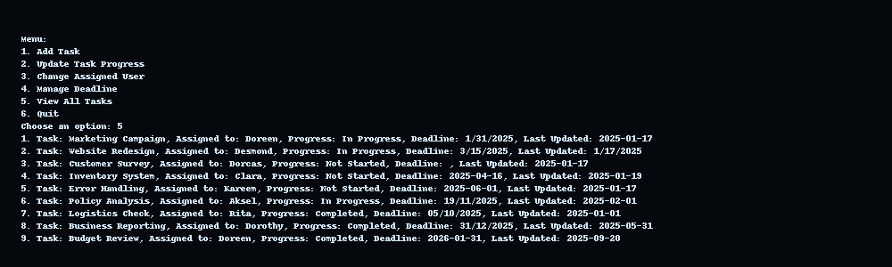

# Task Management (Python + CSV · CLI)



A lightweight, menu-driven **task management system** built in **Python** with **CSV (Excel-compatible)** storage. Runs in **PowerShell/Command Prompt** or IDEs like **Spyder**.

---

## Overview
- **Menu-driven CLI** to add tasks, update progress, reassign owners, and manage deadlines  
- **CSV persistence** (Excel-readable) for simple editing & version control  
- Fast, dependable, and team-friendly for small projects

---

## Features
- **Add Task** (task name, assignee, deadline)  
- **Update Progress** (Not Started / In Progress / Completed)  
- **Change Assigned User**  
- **Manage Deadline** (update or remove)  
- **View All Tasks**

**Menu options 1–6 are defined in the script’s `main()` loop.**

---

## CLI Menu (Screens)

### Full Menu


### Option 1 – Add Task
Action: Add task with assignee + deadline →  
Result: CSV updated, confirmation printed.  


### Option 2 – Update Progress
Action: Select task index → choose status →  
Result: progress updated + timestamp.  


### Option 3 – Change Assigned User
Action: Select task index → new user →  
Result: assignee updated + timestamp.  


### Option 4 – Manage Deadline (Update)
Action: Select task index → new date →  
Result: deadline updated + timestamp.  


### View All Tasks
Action: Display formatted list →  
Result: quick status overview.  


---

## How It Works (in brief)

1. **`load_projects()`** → reads the CSV into memory (list of dicts).  
2. **`save_projects()`** → writes back with the expected header.  
3. **Menu actions** call functions like:
   - `add_project`
   - `update_progress`
   - `change_user`
   - `manage_deadline`
   - `view_projects`  
4. **`main()` loop** → runs until you choose **Quit (6)**.

---

## Example CSV (Draft)

| Task                 | Assignee | Deadline   | Progress     | Last Updated        |
|-----------------------|----------|------------|--------------|---------------------|
| Write project report  | Alice    | 2025-09-30 | In Progress  | 2025-09-18 14:22    |
| Prepare presentation  | Bob      | 2025-10-05 | Not Started  | 2025-09-19 09:13    |
| Update website        | Charlie  | 2025-09-25 | Completed    | 2025-09-15 18:07    |

- Each row = one task.  
- Last Updated = automatic timestamp when changes occur.  
- Fully Excel/LibreOffice compatible.

---

## Why This Project Matters

- **Efficiency** → Fast to run, zero deployment, no DB required.

- **Transparency** → CSV provides clear, auditable change history.

- **Team-ready** → Anyone with Python + Excel can collaborate.

This project shows how structured task tracking can directly support a team’s decision-making by ensuring visibility, accountability, and better planning.

---

## Quickstart

### PowerShell / Command Prompt
```bash
python task_management.py
# or
py task_management.py

